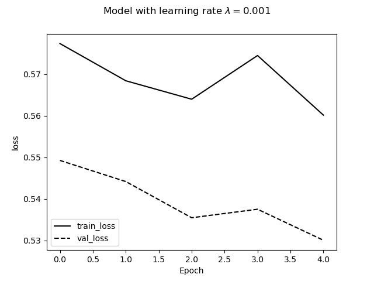

# Mandatory exercise 1

## Some quick notes
 - The majority of the code has been taken from weekly exercise 5 solution. Everything I have coded myself has been commented.
 - I have made an effort to not hard code much into the program, everything except for the path to images when on a ml node and a lesser extent the chosen modules.
 - The program is based on a pretrained resnet18.


## Reproduction routine
 - Assuming all modules are installed, you should only have to run the program. 
 - If you are running the program on your own computer, the program should be located in the same directory as the `mandatory1_data` directory. There is a line which checks if cuda is available and chooses the path to the image directory based on that, the automatic method should work if you run it locally.
 - The best module is saved from training. If you do not wish to train a model, you can uncomment the last line in `main.py`.
 - All files created by the programed will be stored in the directory `output_folder`
   - The auxiliary files containing the list of files for the train-val-test split are created automatically.
   - Everything should be reproducable based on the set seed.
   - A plot is produced containing the training and validation loss curves for the best model

## Task 1:
### The top-10 ranked images and bottom-10 ranked images:
```
Class buildings :
    Top 10:
     ['4875.jpg', '22699.jpg', '6880.jpg', '6295.jpg', '5040.jpg', '2927.jpg', '12508.jpg', '20372.jpg', '3752.jpg', '23205.jpg']
    Bottom 10:
     ['15641.jpg', '19895.jpg', '10936.jpg', '4012.jpg', '14968.jpg', '8481.jpg', '12290.jpg', '4796.jpg', '7328.jpg', '12761.jpg']
Class sea :
    Top 10:
     ['8627.jpg', '5694.jpg', '5517.jpg', '13490.jpg', '11524.jpg', '7128.jpg', '13444.jpg', '22260.jpg', '5547.jpg', '12881.jpg']
    Bottom 10:
     ['12761.jpg', '12845.jpg', '5034.jpg', '14803.jpg', '17691.jpg', '5147.jpg', '22664.jpg', '11026.jpg', '5454.jpg', '13032.jpg']
Class mountain :
    Top 10:
     ['7853.jpg', '4012.jpg', '7328.jpg', '15050.jpg', '23208.jpg', '22260.jpg', '16571.jpg', '14968.jpg', '7717.jpg', '14962.jpg']
    Bottom 10:
     ['21040.jpg', '6032.jpg', '11888.jpg', '12505.jpg', '11026.jpg', '21750.jpg', '23682.jpg', '22664.jpg', '5454.jpg', '13032.jpg']
``` 
 - Having checked a few of the images, the images seem to match their class; this shows that the model at the very least does something

### Loss curves



 - We see that there are slight improvements for every epoch, with an exeption for epoch 3 which sees a particular big jump in loss for the training. While it appears big in the graph, the aboslute difference is not very big, suggesting it might be caused by the epoch having a heavier load of images belonging to categories the model does badly at predicting.

### Mean class-wise accuracy (training and validation)
```
Epoch 1/5
----------
Accuracy per class: (training)
    buildings, 0.7526055951727921
    sea, 0.7527862208713273
    mountain, 0.702414113277623
    forest, 0.931266149870801
    glacier, 0.7708432586946165
    street, 0.8223523670082967

Accuracy per class: (validation)
    buildings, 0.721030042918455
    sea, 0.7549019607843137
    mountain, 0.7020872865275142
    forest, 0.9761431411530815
    glacier, 0.8151093439363817
    street, 0.8391038696537678

Epoch 2/5
----------
Accuracy per class: (training)
    buildings, 0.7569939659901261
    sea, 0.7877406281661601
    mountain, 0.7005571030640668
    forest, 0.9235142118863049
    glacier, 0.7575035731300619
    street, 0.8169838945827232

Accuracy per class: (validation)
    buildings, 0.7274678111587983
    sea, 0.7568627450980392
    mountain, 0.6337760910815939
    forest, 0.9542743538767395
    glacier, 0.8409542743538767
    street, 0.9042769857433809

Epoch 3/5
----------
Accuracy per class: (training)
    buildings, 0.7668678003291278
    sea, 0.7740628166160081
    mountain, 0.7089136490250696
    forest, 0.9297157622739018
    glacier, 0.7651262505955216
    street, 0.8306490971205466

Accuracy per class: (validation)
    buildings, 0.7467811158798283
    sea, 0.8392156862745098
    mountain, 0.6755218216318786
    forest, 0.94831013916501
    glacier, 0.7932405566600398
    street, 0.8391038696537678

Epoch 4/5
----------
Accuracy per class: (training)
    buildings, 0.7679648930334614
    sea, 0.7847011144883486
    mountain, 0.7140204271123491
    forest, 0.9302325581395349
    glacier, 0.7579799904716532
    street, 0.8247925817471937

Accuracy per class: (validation)
    buildings, 0.7424892703862661
    sea, 0.796078431372549
    mountain, 0.6963946869070209
    forest, 0.9582504970178927
    glacier, 0.7872763419483101
    street, 0.8513238289205702

Epoch 5/5
----------
Accuracy per class: (training)
    buildings, 0.7739989029072957
    sea, 0.7710233029381965
    mountain, 0.7107706592386258
    forest, 0.9291989664082687
    glacier, 0.7622677465459743
    street, 0.828696925329429

Accuracy per class: (validation)
    buildings, 0.7660944206008584
    sea, 0.7980392156862746
    mountain, 0.7096774193548387
    forest, 0.9662027833001988
    glacier, 0.7833001988071571
    street, 0.8513238289205702
```
 - We see that the model is very good at predicting `forest` and `streets`. Perhaps attributed to their more unique color schemes. Further investigation might be necessary to fully conclude why.
 - Surprisingly, the model performs the worst at predicting `mountains`. I had initially suspected it to be one of the easier ones and instead `street` and `buldings` to be the harder ones as they might be similiar. It might be confused by `sea` and `mountains` as they both may contain a lot of blue.
 - A confusion matrix might clarify further what classes the model confuse with each other.
 - I have also not looked into the balance of the different classes, this might also be a factor, as accuracy does not do a good job at taking imbalance into consideration.

### Mean class-wise accuracy and average precision (Testing)

```
Accuracy per class: (testing)
    buildings, 0.7846607669616519
    sea, 0.76
    mountain, 0.7359550561797753
    forest, 0.9511400651465798
    glacier, 0.7126760563380282
    street, 0.8104956268221575
```
 - Overall the accuracy is slightly lower for testing, compared to training and testing; as expected.
 - The class `glacier` now takes the spot of the least accurate class.
```
Average precision: 
     buildings :  0.743681485596104
     sea :  0.649656692618268
     mountain :  0.6627397295202011
     forest :  0.9743209676336161
     glacier :  0.7258079693725159
     street :  0.832321245823463
```
 - A lower average precision means that the recall is low. Meaning:
   - the recall of `sea` and `mountain` are much worse than their accuracy,
   - while the recall for `forest` appears to be even higher than the already high accuracy.

## Task 2
### Computed statistic for five chosen modules
```
Computed statistic for 5 chosen layers:
    layer1.1.relu = 0.494412362575531
    layer2.1.relu = 0.72392338514328
    layer3.1.relu = 0.8017155528068542
    layer4.0.relu = 0.9351847767829895
    layer4.1.relu = 0.9435327649116516
```
 - The number of non-positive elements seem to increase for later layers in the module, starting out with a close to 50/50 distribution. I am unsure what this implies.